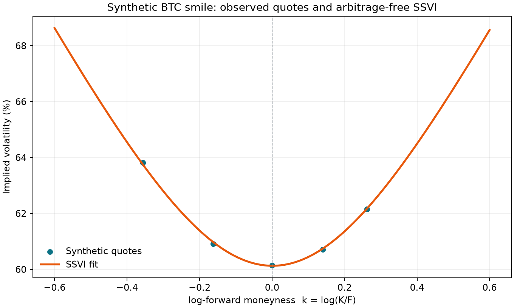
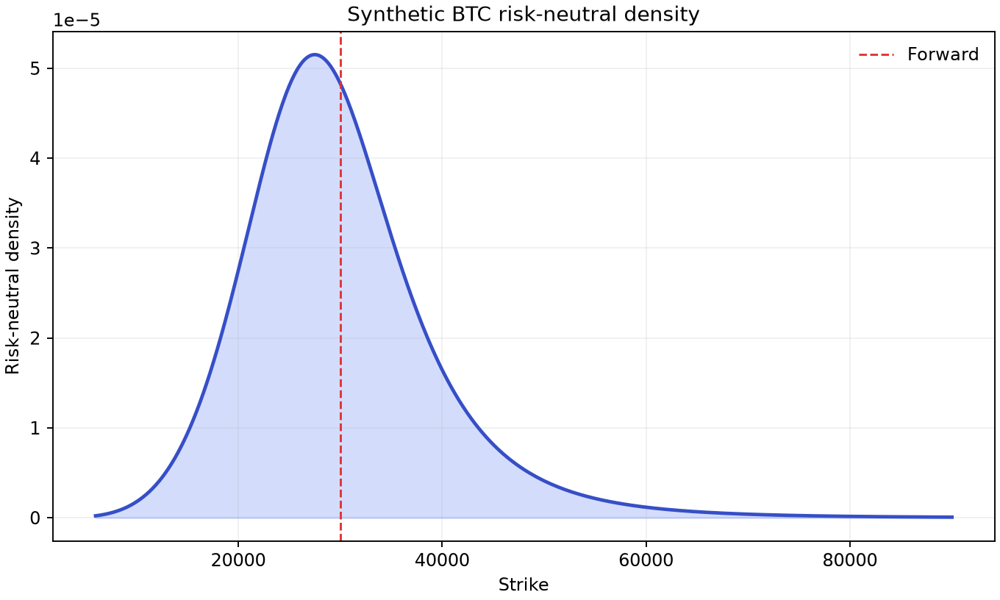
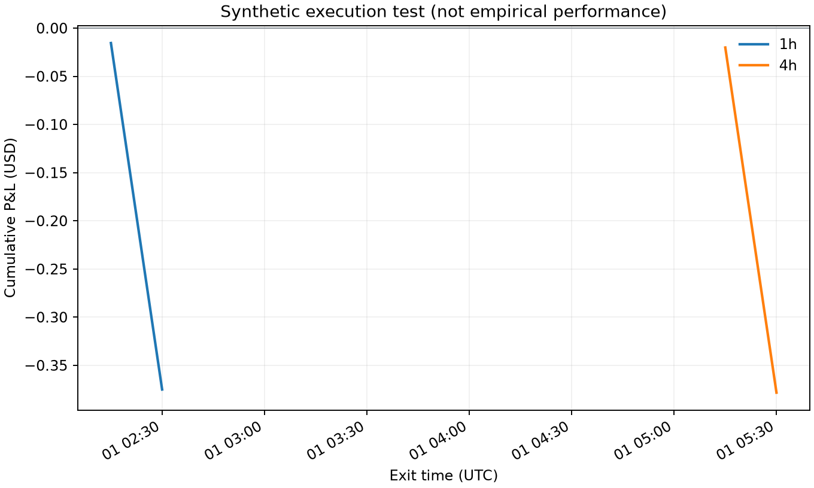

# Arbitrage-Free Crypto Volatility Lab

[](https://github.com/mohamedryadi-creator/crypto-volatility-lab/actions/workflows/ci.yml)
[](https://www.python.org/)
[](LICENSE)

Research-grade Python toolkit for fitting arbitrage-free BTC/ETH volatility surfaces and testing
whether executable cross-sectional mispricing mean-reverts after bid-ask spreads, fees, funding and
delta hedging.

The project is designed as a quant-trading research artifact: the hypothesis is fixed before the
backtest, fills occur on the next snapshot, inference is clustered by trading day, and ETH is a
locked external validation market rather than another hyperparameter search.

## Research question

> Do liquid options that are cheap relative to an arbitrage-free SSVI surface outperform
> vega-matched rich options over one- and four-hour horizons, net of executable costs?

BTC is used for development and chronological validation. Every threshold and model choice is then
frozen before testing ETH. A negative result is informative: it measures how much midpoint
“mispricing” disappears once the spread and hedge are paid.

```mermaid
flowchart LR
    A["Tardis monthly tick samples"] --> B["Streaming parser + SHA-256 manifest"]
    B --> C["Backward-looking 15-minute snapshots"]
    C --> D["Black-76 and implied volatility"]
    D --> E["SVI / SSVI calibration"]
    E --> F["Sufficient + numerical arbitrage audit"]
    F --> G["Bid-ask residual signal"]
    G --> H["Vega-neutral pair + perp delta hedge"]
    H --> I["Next-snapshot execution"]
    I --> J["Day-clustered inference + ETH lockbox"]
```



## What is implemented

- Black-76 prices, robust implied-volatility inversion and analytical Greeks.
- Raw SVI slices and a global SSVI surface with constrained parameters.
- Blocking numerical audits on every accepted surface: analytical butterfly \(g(k)\), calendar
  total variance, and call-price monotonicity, vertical-spread bounds and convexity.
- Breeden-Litzenberger risk-neutral density and model-free variance integration.
- Streaming Tardis downloads with retry, checksum, manifest and explicit terms acceptance.
- Strictly backward-looking resampling; no same-timestamp signal and execution.
- Long-cheap/short-rich, vega-neutral option pairs with a fresh, same-asset Deribit
  inverse-perpetual delta hedge; there is no option-index or synthetic hedge fallback.
- Inverse-perpetual USD-notional sizing, coin-settled P&L, bid/ask fills, fees, funding, size limits,
  scenario-loss controls and P&L attribution.
- UTC-day P&L aggregation and day-clustered inference in the runner; stationary/fixed-block
  bootstrap, multiple-testing correction and deflated Sharpe utilities for registered sensitivity
  studies.
- Deterministic synthetic fixtures, unit tests, type checking, linting and GitHub Actions.

The complete derivations and assumptions are in [docs/theory.md](docs/theory.md). The normalized
data contract is in [docs/data.md](docs/data.md).

## Synthetic pipeline preview

The checked-in demo is a deterministic engineering test, not empirical evidence of alpha. With
seed 7 it completes 40 surface calibrations without failure, passes both the sufficient SSVI
restrictions and the applied numerical static-arbitrage audits, and recovers a risk-neutral
density with raw mass 0.9988.

| Arbitrage-free SSVI smile | Risk-neutral density |
|---|---|
|  |  |



Only four toy trades are produced, with net P&L of -$0.75 after the modeled option, hedge and fee
components. That result is deliberately reported rather than optimized: the demo validates the
research pipeline, while any economic claim requires the complete predeclared real-data protocol.

## Data

The default source is the [Tardis.dev Deribit archive](https://docs.tardis.dev/historical-data-details/deribit):

- tick-level `options_chain / OPTIONS` snapshots, normalized to inverse BTC/ETH options only;
- executable `BTC-PERPETUAL` and `ETH-PERPETUAL` hedge quotes;
- the first calendar day of each month from March 2020 through August 2026, available without an
  API key according to the provider documentation.

This is a rich intraday dataset but only about 78 independent calendar dates. The analysis never
pretends that thousands of intraday rows are thousands of independent days.

Raw and row-level market data are intentionally excluded from Git. `download` streams and verifies
one compressed file, deleting it at context exit unless `--keep-raw` is explicit; `prepare` is the
separate normalization step. Every user must review the current
[provider terms](https://docs.tardis.dev/legal/terms-of-service) before downloading. Real-data
partitions and reports stay local unless the user separately verifies publication rights; the
public demo uses synthetic data.

## Quick start

```bash
git clone https://github.com/mohamedryadi-creator/crypto-volatility-lab.git
cd crypto-volatility-lab
python3.11 -m venv .venv
source .venv/bin/activate
python -m pip install -e '.[dev]'
```

Run the deterministic end-to-end demo:

```bash
crypto-vol-lab demo --output reports/generated --seed 7
```

Validate the checked-in research configuration:

```bash
crypto-vol-lab config --path configs/research.toml
```

Download one free first-of-month sample. The flag is deliberately verbose so that acceptance of
third-party terms cannot happen accidentally. Download the option universe and both executable
perpetual hedge books for a complete research day:

```bash
crypto-vol-lab download \
  --date 2024-01-01 \
  --output data/raw \
  --keep-raw \
  --accept-provider-terms

crypto-vol-lab download \
  --date 2024-01-01 \
  --data-type quotes \
  --symbol BTC-PERPETUAL \
  --output data/raw \
  --keep-raw \
  --accept-provider-terms

crypto-vol-lab download \
  --date 2024-01-01 \
  --data-type quotes \
  --symbol ETH-PERPETUAL \
  --output data/raw \
  --keep-raw \
  --accept-provider-terms
```

Each download prints a JSON provenance record containing its exact randomized `raw_path`. Assign
the three exact paths printed by the commands (do not use broad globs after repeated downloads),
then prepare them together as backward-looking snapshots:

```bash
OPTIONS_RAW=/absolute/path/from/options/raw_path
BTC_PERP_RAW=/absolute/path/from/btc-perpetual/raw_path
ETH_PERP_RAW=/absolute/path/from/eth-perpetual/raw_path

crypto-vol-lab prepare \
  --input "$OPTIONS_RAW" \
  --input "$BTC_PERP_RAW" \
  --input "$ETH_PERP_RAW" \
  --output data/processed \
  --config configs/research.toml \
  --strict

crypto-vol-lab backtest \
  --input data/processed \
  --config configs/research.toml \
  --output reports/generated
```

This one-day command sequence is a pipeline smoke test, not the full study. The research report
audits expected monthly partitions and disables confirmatory claim eligibility when dates or
required option/perpetual components are missing. It also verifies the active config, strict-mode
provenance, row counts, SHA-256 checksums and exact partition inventory. Retained raw files and all
prepared partitions must remain private under the provider terms.

Run the quality gate used in CI:

```bash
make check
```

## Predeclared empirical protocol

| Stage | Market | Dates | Purpose |
|---|---|---:|---|
| Development | BTC | 2020-03 to 2023-12 | model and threshold selection |
| Validation | BTC | 2024-01 to 2024-12 | one controlled revision pass |
| Final test | BTC | 2025-01 to 2026-08 | untouched out-of-sample estimate |
| External lockbox | ETH | 2025-01 to 2026-08 | transfer without retuning |

Signals formed at time \(t\) enter at the next 15-minute snapshot and exit after 60 or 240
minutes. Longs pay the ask, shorts receive the bid, and both the option legs and perpetual hedge
pay configurable costs. A missing or stale same-asset perpetual quote at entry or exit produces a
skipped trade; an option underlying/index value is never substituted as an executable hedge.
Within each holding horizon,
trade P&L and turnover are summed by UTC exit day before any performance statistic is calculated.
Sharpe uses daily totals, a zero risk-free rate and \(\sqrt{365}\) crypto-calendar annualization; it
is reported as unavailable with fewer than two observed days. Confidence intervals resample whole
UTC days.

## Repository layout

```text
src/crypto_vol_lab/
  pricing.py          Black-76, IV and Greeks
  svi.py              SVI/SSVI fitting and static-arbitrage diagnostics
  risk_neutral.py     density and variance extraction
  data.py             streaming download, normalization and resampling
  signals.py          executable residual scores and portfolio selection
  backtest.py         execution, hedging and P&L attribution
  statistics.py       robust performance inference
  experiment.py       reproducible orchestration and reports
docs/
  theory.md           mathematical derivations and research protocol
  data.md             source, schema, temporal and licensing rules
notebooks/             thin package-API walkthrough (no duplicated research logic)
tests/                deterministic unit and integration tests
configs/              immutable experiment configuration
```

## Interpretation guardrails

- This is an offline research framework, not a live trading system.
- SSVI fit quality does not prove tradability; only bid/ask backtests address execution.
- Current exchange fees are sensitivity parameters, not claimed historical fee records.
- Funding is a configurable constant sensitivity (zero by default), not a reconstructed historical
  funding series.
- Hedge amounts are continuous in the research engine. A deployment layer must round the signed USD
  amount to Deribit's $10 BTC-PERPETUAL or $1 ETH-PERPETUAL contract increment and recompute residual
  delta.
- The first-of-month free sample creates selection bias that is stated, measured and never hidden.
- Risk-neutral densities describe prices under \(\mathbb Q\), not real-world crash probabilities.

## Core references

- Gatheral and Jacquier, [Arbitrage-free SVI volatility surfaces](https://arxiv.org/abs/1204.0646).
- Deribit, [Inverse Options](https://support.deribit.com/hc/en-us/articles/31424939096093-Inverse-Options).
- Tardis.dev, [Downloadable CSV files](https://docs.tardis.dev/downloadable-csv-files).

Code is MIT licensed. Market data remain subject to their providers' terms.
